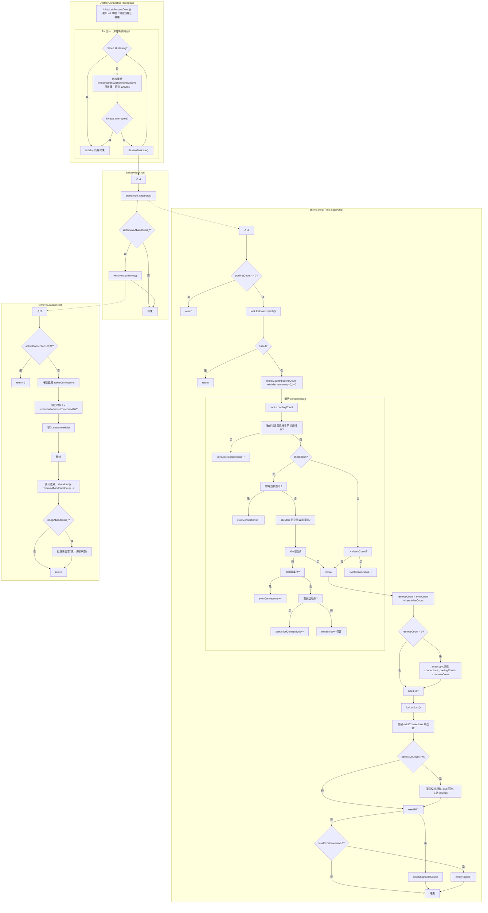

# DestroyConnectionThread 执行流程图

## 一、Mermaid 流程图

---

## 二、流程说明表

| 模块 | 说明 |
|------|------|
| DestroyConnectionThread.run | 先 initedLatch.countDown()，再循环：检查 closed/closing → sleep → 检查中断 → destroyTask.run()，任一处退出则线程结束。 |
| DestroyTask.run | 先执行 shrink(true, keepAlive)，再根据 isRemoveAbandoned() 决定是否执行 removeAbandoned()。 |
| shrink | 持锁扫描空闲池，按致命错误/物理超时/空闲时间/保活间隔分类为 evict 或 keepAlive；压缩池、关闭被剔除连接、对保活连接校验后回池或丢弃；必要时 emptySignal 补连。 |
| removeAbandoned | 持 activeConnectionLock 扫描 activeConnections，将借出超时的连接移入 abandonedList 并关闭、abandond，可选打泄漏日志。 |

---

## 三、shrink 分支说明表

| 条件 | 结果 |
|------|------|
| poolingCount == 0 | return，不执行本次 shrink。 |
| !inited | return。 |
| 致命错误且连接建立早于错误时间 | 放入 keepAliveConnections，后续做保活校验。 |
| checkTime 且物理连接超时 | 放入 evictConnections，后续关闭。 |
| idleMillis 很短（小于 minEvictable 且小于 keepAliveBetween） | break 结束遍历。 |
| idleMillis 达剔除条件（i<checkCount 或 idle>maxEvictable） | 放入 evictConnections。 |
| keepAlive 且距上次保活>=keepAliveBetween | 放入 keepAliveConnections。 |
| 以上都不满足 | remaining++，保留在池中。 |

---

## 四、removeAbandoned 步骤表

| 步骤 | 说明 |
|------|------|
| 1 | activeConnections 为空则 return 0。 |
| 2 | 持 activeConnectionLock 遍历，!isRunning() 且借出时长>=removeAbandonedTimeoutMillis 的移入 abandonedList。 |
| 3 | 解锁后对 abandonedList 每条：close、abandond()、removeAbandonedCount++。 |
| 4 | 若 isLogAbandoned() 则打日志（owner thread、connected at、open stackTrace、current stackTrace）。 |
| 5 | return removeCount。 |
