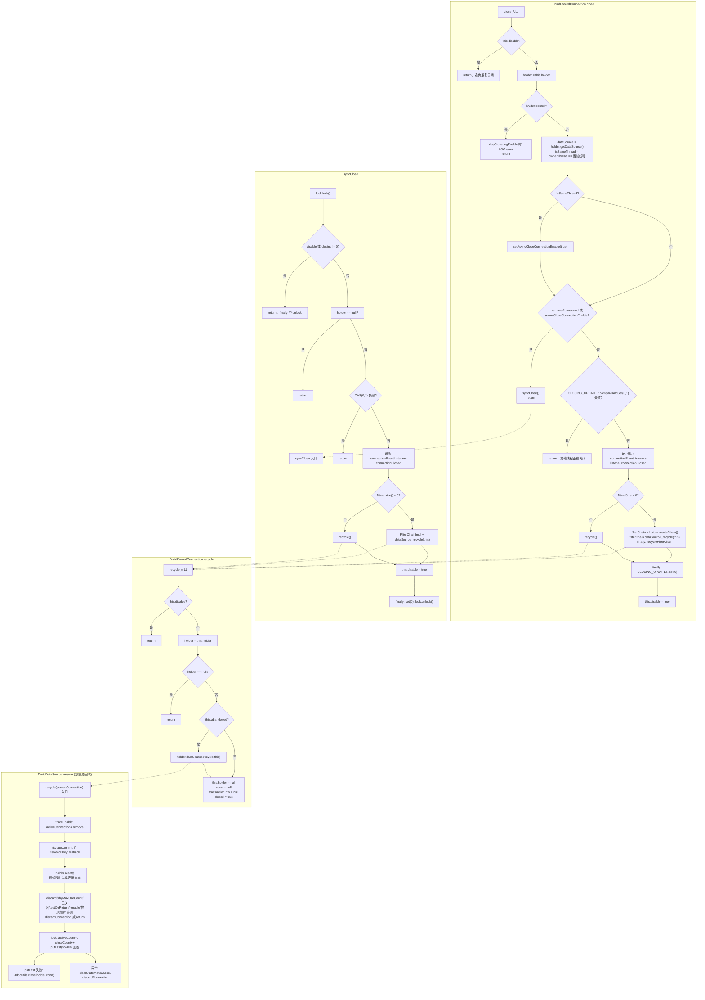

# DruidPooledConnection#close 流程图

## 简要说明

- **close()**：先做 disable/holder 检查；非借出线程则 setAsyncCloseConnectionEnable(true)；满足 removeAbandoned 或 asyncClose 则走 **syncClose()** 并 return；否则 CAS 抢关闭权，通知监听器后走 **dataSource_recycle** 或 **recycle()**，finally 还原 closing，最后 disable=true。
- **syncClose()**：持连接 lock，再次检查 disable/closing/holder 与 CAS，通知监听器后同样走 dataSource_recycle 或 **recycle()**，finally 还原 closing 并 unlock。
- **recycle()**：未 disable、holder 非空且 !abandoned 时调用 **holder.dataSource.recycle(this)**；最后统一清空 holder/conn 并设 closed=true。
- **DruidDataSource.recycle**：从 activeConnections 移除、rollback、reset，按条件 discard 或 **putLast** 回池，异常时 discardConnection。
